# 🚀 FinBot-Crypto - Advanced Microservices Trading System

Bem-vindo à organização **FinBot-Crypto**. Este ecossistema é uma plataforma profissional de trading algorítmico distribuído, projetada para alta escalabilidade, tolerância a falhas e execução em tempo real na exchange Binance.

## 🏗️ Stack Tecnológica & Infraestrutura

Nossa arquitetura foi desenhada seguindo os princípios de **Sistemas Distribuídos** e **Arquitetura Baseada em Eventos (EDA)**.

| Componente | Tecnologia | Papel no Ecossistema |
|------------|------------|-----------------------|
| **Cloud** | Oracle Cloud VPS | Host de produção de alta performance e baixa latência. |
| **Orquestração** | Docker & Docker Compose | Isolamento e padronização de ambientes. |
| **Mensageria** | NATS JetStream | "Sistema Nervoso" — comunicação assíncrona persistente entre serviços. |
| **Cache & Estado** | NATS KV Store | Armazenamento de estado rápido (posições abertas, cache de mercado). |
| **Banco de Dados** | PostgreSQL 16 | Persistência de longo prazo para trades, logs e datasets de ML. |
| **Linguagem** | Python 3.11+ | Lógica de negócios, ML e integração de APIs. |
| **CI/CD** | GitHub Actions | Workflows padronizados para deploy automático em 12+ repositórios. |

---

## 🧩 Catálogo de Microserviços

O sistema é composto por 12 serviços independentes que colaboram via NATS:

1.  **[fb-market-selection](https://github.com/FinBot-Crypto/fb-market-selection)**: Filtra os ativos mais líquidos e atribui Tiers (Major, Strong Alt, High Volatility).
2.  **[fb-strategy-ml](https://github.com/FinBot-Crypto/fb-strategy-ml)**: O coração analítico. Calcula indicadores técnicos e scores de ML para múltiplas estratégias.
3.  **[fb-decision-engine](https://github.com/FinBot-Crypto/fb-decision-engine)**: O orquestrador de decisões. Consolida scores e escolhe a melhor estratégia por ativo.
4.  **[fb-trade-decision](https://github.com/FinBot-Crypto/fb-trade-decision)**: Define os parâmetros operacionais (Preço de Entrada, Stop Loss, Take Profit).
5.  **[fb-risk-management](https://github.com/FinBot-Crypto/fb-risk-management)**: Calcula o Position Sizing ideal baseado no risco da banca (ex: 2% por trade).
6.  **[fb-execution](https://github.com/FinBot-Crypto/fb-execution)**: Executa as ordens reais na Binance via API Segura.
7.  **[fb-position-management](https://github.com/FinBot-Crypto/fb-position-management)**: Monitora trades abertos e gerencia o **Trailing Stop**.
8.  **[fb-analytics](https://github.com/FinBot-Crypto/fb-analytics)**: Registra performance, PnL e gera dados para auditoria.
9.  **[fb-ml-training](https://github.com/FinBot-Crypto/fb-ml-training)**: Treina novos modelos de ML de forma offline.
10. **[fb-ml-validation](https://github.com/FinBot-Crypto/fb-ml-validation)**: Roda backtests rigorosos antes de promover modelos para produção.
11. **[fb-control-api](https://github.com/FinBot-Crypto/fb-control-api)**: API FastAPI para monitoramento e controle manual.
12. **[fb-notifier](https://github.com/FinBot-Crypto/fb-notifier)**: Alertas via Telegram para cada evento crítico do sistema.

---

## 📈 Fluxo de Operação (Pipeline)

```mermaid
graph LR
    A[Market Selection] -->|market.updated| B[Strategy ML]
    B -->|strategies.evaluated| C[Decision Engine]
    C -->|decision.made| D[Trade Decision]
    D -->|trade.planned| E[Risk Management]
    E -->|risk.approved| F[Execution]
    F -->|order.filled| G[Position Management]
    G -->|trade.closed| H[Analytics]
```

---

## ⚡ Simulação de Cenário Real

Para entender como a mágica acontece, imagine o seguinte fluxo:

1.  **09:00** - `fb-market-selection` detecta que **SOL/USDT** entrou no Top 10 de volume. Ele publica no NATS: `{ symbol: "SOL/USDT", tier: "Strong Alt" }`.
2.  **09:01** - `fb-strategy-ml` recebe o evento, baixa o histórico e identifica um RSI de 28 e cruzamento de médias. Ele publica: `{ scores: { mean_reversion: 0.85, trend: 0.3 } }`.
3.  **09:01** - `fb-decision-engine` vê o score de 0.85 e decide: **"Vamos operar Reversão à Média"**.
4.  **09:02** - `fb-trade-decision` calcula a entrada no preço atual, um Stop Loss 2% abaixo e Take Profit 5% acima.
5.  **09:02** - `fb-risk-management` checa o saldo da conta e define que, para esse risco, a ordem deve ser de **$500.00**.
6.  **09:03** - `fb-execution` envia a ordem OCO para a Binance. O `fb-notifier` envia mensagem no Telegram: *"🟢 Compra efetuada: SOL/USDT ($500)"*.
7.  **11:45** - `fb-position-management` percebe que o preço subiu 3%. Ele move o Stop Loss para o ponto de entrada (**Breakeven**).
8.  **15:00** - O preço atinge o Take Profit. A ordem é fechada. `fb-analytics` registra um lucro de **$25.00**.

---

*FinBot-Crypto - Trading with Discipline and Technology.*
